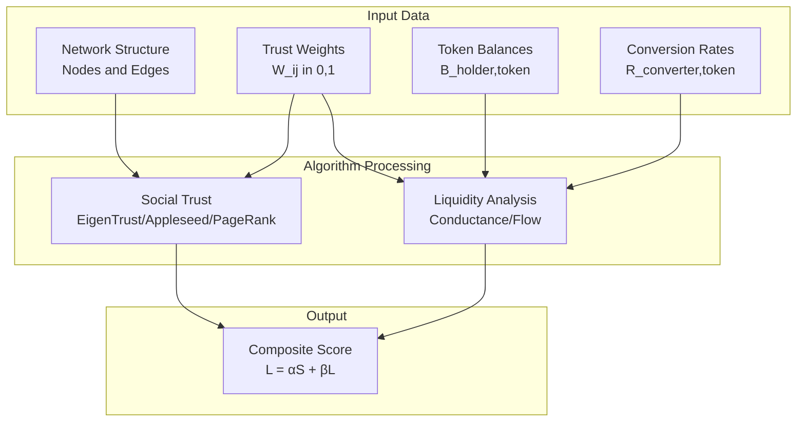
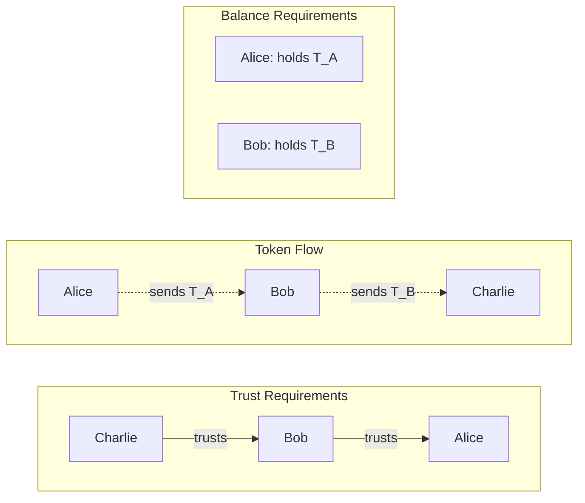
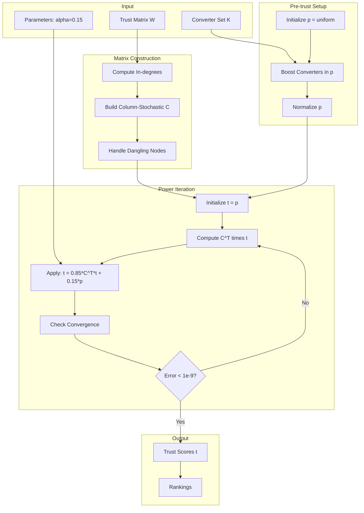
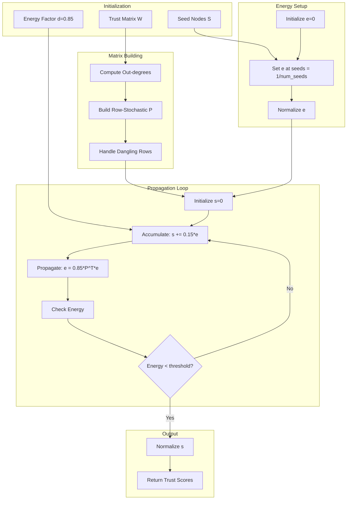
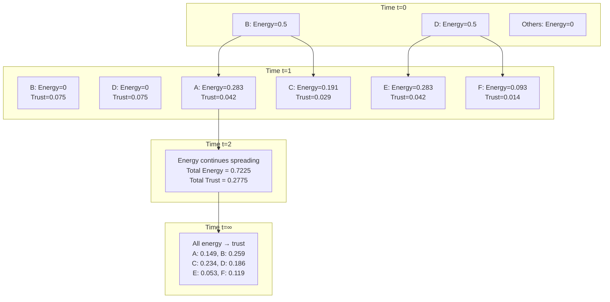
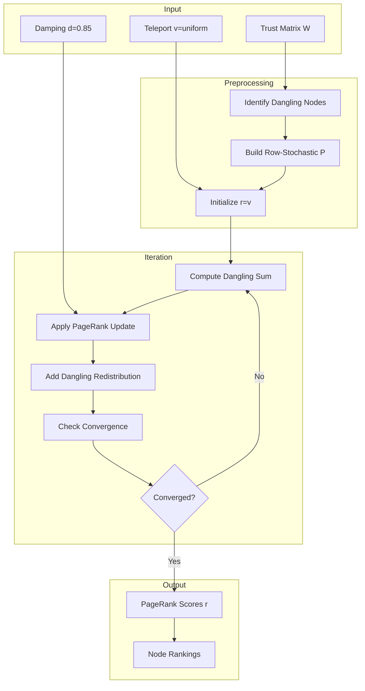
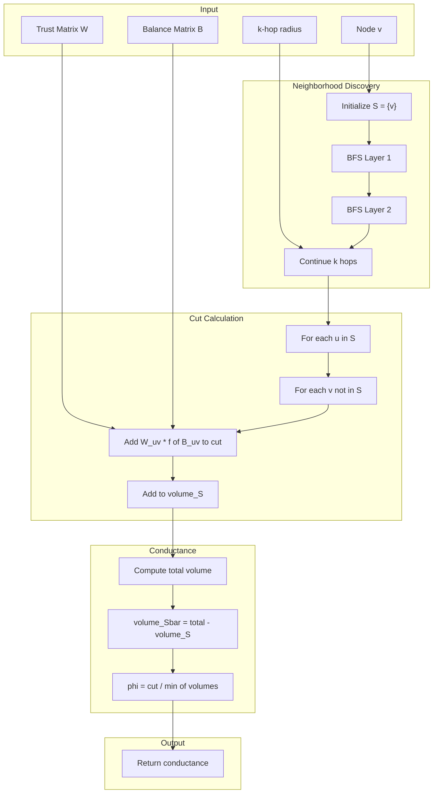
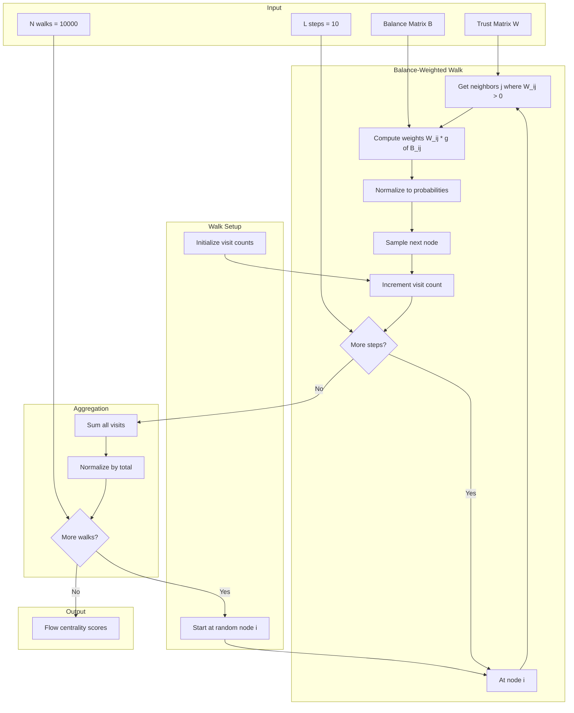
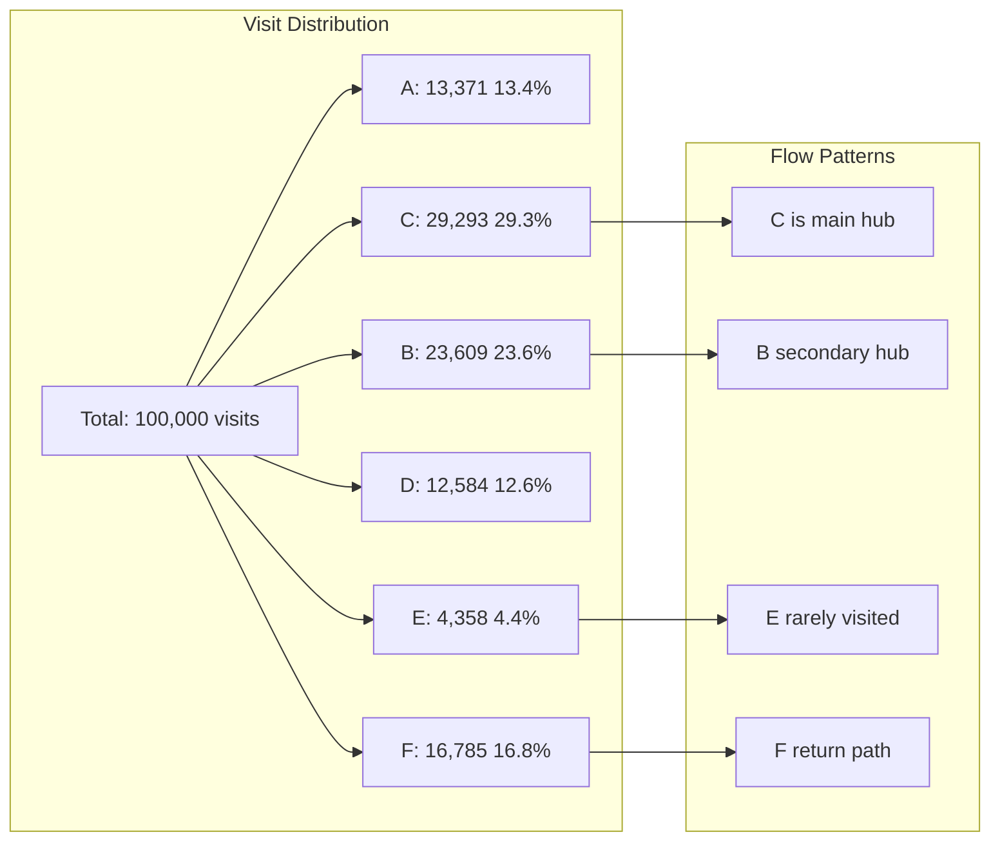
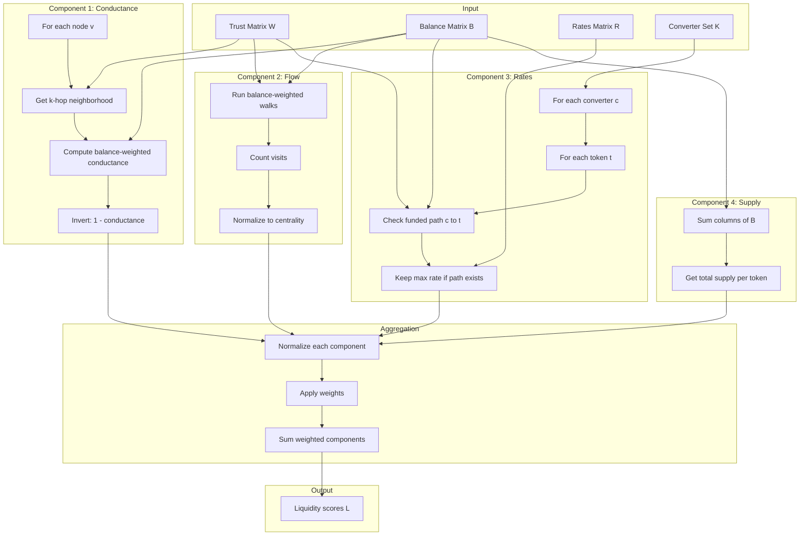

# Complete Trust Network Algorithm Framework: Comprehensive Theory and Implementation

## Table of Contents
1. [Mathematical Foundations and Core Definitions](#1-mathematical-foundations-and-core-definitions)
2. [The Critical Role of Trust and Balances in Token Networks](#2-the-critical-role-of-trust-and-balances-in-token-networks)
3. [EigenTrust: Complete Theory and Implementation](#3-eigentrust-complete-theory-and-implementation)
4. [Appleseed: Energy Propagation Framework](#4-appleseed-energy-propagation-framework)
5. [PageRank: Random Walk Theory](#5-pagerank-random-walk-theory)
6. [Conductance: Graph Partitioning Theory](#6-conductance-graph-partitioning-theory)
7. [Flow Centrality: Stochastic Process Analysis](#7-flow-centrality-stochastic-process-analysis)
8. [Hybrid Liquidity: Multi-Objective Optimization](#8-hybrid-liquidity-multi-objective-optimization)

---

## 1. Mathematical Foundations and Core Definitions

### 1.1 Complete Network Model

**Definition 1.1 (Decentralized Token Network):**
A decentralized token network is formally defined as the tuple:

$$\mathcal{N} = (V, E, W, T, B, K, R, \tau)$$

Where:
- $V = \{v_1, v_2, \ldots, v_n\}$ is the set of nodes (participants)
- $E \subseteq V \times V$ is the set of directed edges (trust relationships)
- $W: E \rightarrow (0,1]$ is the trust weight function
- $T = \{T(v) \mid v \in V\}$ is the set of tokens (each node issues one token)
- $B: V \times T \rightarrow \mathbb{R}_{\geq 0}$ is the balance function
- $K \subseteq V$ is the set of converter nodes (bridge to fiat)
- $R: K \times T \rightarrow \mathbb{R}_{\geq 0}$ is the conversion rate function
- $\tau \in (0, 1]$ is the trust acceptance threshold

### 1.2 Trust Matrix Representation

**Definition 1.2 (Trust Adjacency Matrix):**
The trust adjacency matrix $\mathbf{W} \in [0,1]^{n \times n}$ is defined as:

$$W_{ij} = \begin{cases}
w \in (0,1] & \text{if node } i \text{ trusts node } j \text{ (accepts } T(j)\text{)} \\
0 & \text{otherwise}
\end{cases}$$

**Critical Interpretation:** $W_{ij} = 1$ means node $i$ trusts node $j$, which means **node $i$ accepts tokens issued by node $j$**.

### 1.3 Balance Matrix Representation

**Definition 1.3 (Balance Matrix):**
The balance matrix $\mathbf{B} \in \mathbb{R}_{\geq 0}^{n \times n}$ where:

$$B_{ij} = \text{amount of token } T(j) \text{ held by node } i$$

**Key Properties:**
- $B_{ij}$ = how much of $j$'s token is held by $i$
- Column sum: $\sum_{i=1}^n B_{ij} = S(j)$ is the total supply of token $T(j)$
- Row sum: $\sum_{j=1}^n B_{ij}$ is the total token value held by node $i$

### 1.4 Stochastic Matrix Definitions

**Definition 1.4 (Row-Stochastic Matrix):**
A matrix $\mathbf{P}$ is row-stochastic if each row sums to 1:

$$\mathbf{P} = \mathbf{D}_{\text{out}}^{-1} \mathbf{W}$$

where:

```math
\mathbf{D}_{\text{out}} =
\begin{bmatrix}
\sum_{j} W_{1j} & 0 & \cdots & 0 \\
0 & \sum_{j} W_{2j} & \cdots & 0 \\
\vdots & \vdots & \ddots & \vdots \\
0 & 0 & \cdots & \sum_{j} W_{nj}
\end{bmatrix}
```

**Definition 1.5 (Column-Stochastic Matrix):**
A matrix $\mathbf{C}$ is column-stochastic if each column sums to 1:

$$\mathbf{C} = \mathbf{W} \mathbf{D}_{\text{in}}^{-1}$$

where:

```math
\mathbf{D}_{\text{in}} = \begin{bmatrix}
\sum_{i} W_{i1} & 0 & \cdots & 0 \\
0 & \sum_{i} W_{i2} & \cdots & 0 \\
\vdots & \vdots & \ddots & \vdots \\
0 & 0 & \cdots & \sum_{i} W_{in}
\end{bmatrix}
```


### 1.5 Trust Score Pipeline



---

## 2. The Critical Role of Trust and Balances in Token Networks

### 2.1 Trust Creates Token Acceptance

**Fundamental Principle:** Trust determines which tokens a node will accept.

If $W_{ij} = 1$, then:
- Node $i$ trusts node $j$
- Node $i$ accepts token $T(j)$ (the token issued by $j$)
- Node $i$ can receive payments in token $T(j)$

### 2.2 Token Flow Direction

**Critical Understanding:** For a payment to flow from source to target, we need:

1. **Trust Path:** Target must trust intermediate nodes (creates acceptance)
2. **Token Path:** Source's tokens must flow through intermediates who accept them

Consider Alice → Bob → Charlie payment:



For Alice to pay Charlie:
- Charlie must trust Bob ($W_{CB} = 1$) to accept $T(B)$
- Bob must trust Alice ($W_{BA} = 1$) to accept $T(A)$
- Alice must have her own tokens: $B_{A,A} > 0$
- Bob must have Alice's tokens to forward: $B_{B,A} > 0$

### 2.3 Payment Capacity Formula

**Definition 2.1 (Payment Capacity for Token Flow):**
For a payment of token $T(s)$ from source $s$ to target $t$ through path $P = (s = v_0, v_1, ..., v_k = t)$:

```math
\text{Capacity}(s \to t, T(s)) = \min_{i=0}^{k-1} \left\{ B_{v_i, s} \cdot \mathbb{1}[W_{v_{i+1}, s} \geq \tau] \right\}
```

This means:
- Each node $v_i$ must hold token $T(s)$
- Next node $v_{i+1}$ must trust source $s$ (accept $T(s)$)
- Capacity is the minimum balance of $T(s)$ along the path


---

## 3. EigenTrust: Complete Theory and Implementation

### 3.1 Theoretical Foundation

EigenTrust is fundamentally a **transitive trust aggregation** system that models how trust "flows" through a network via a random walk process.

#### 3.1.1 Core Mathematical Framework

The EigenTrust score vector $\mathbf{t} \in \mathbb{R}^n$ represents the stationary distribution of a modified random walk:

```math
\mathbf{t} = (1-\alpha)\mathbf{C}^T\mathbf{t} + \alpha\mathbf{p}
```

**Intuitive Interpretation:**
- $(1-\alpha)$: Probability of following trust relationships
- $\alpha$: Probability of "teleporting" to a trusted seed node
- This creates a **damped trust propagation** where distant trust matters less

#### 3.1.2 The Random Walk Perspective

Consider a **trust walker** that:
1. Starts at a random node with probability $p_i$
2. At each step, with probability $(1-\alpha)$:
   - Follows an incoming trust edge (weighted by trust values)
3. With probability $\alpha$:
   - Teleports to a pre-trusted node according to $\mathbf{p}$

The **stationary distribution** of this walk gives EigenTrust scores.

**Why This Works:**
- Nodes trusted by many high-trust nodes get higher scores
- Trust propagates transitively: $A \rightarrow B \rightarrow C$
- Teleportation prevents manipulation and ensures convergence

#### 3.1.3 Matrix Construction Theory

**Column-Stochastic Trust Matrix:**

```math
\mathbf{C} = \mathbf{W}\mathbf{D}_c^{-1}
```

Where $\mathbf{D}_c$ is the diagonal matrix of column sums. This ensures:

```math
\sum_{i=1}^n C_{ij} = 1 \quad \forall j
```

**Physical Meaning:** Each column represents how node $j$'s trust is distributed to other nodes.

**Handling Dangling Nodes:**
For nodes with no outgoing trust (column sum = 0):

```math
\mathbf{C}[:,j] = \frac{1}{n}\mathbf{e}
```

This means **untrusting nodes distribute trust uniformly** - preventing dead ends in the random walk.

#### 3.1.4 The Teleportation Matrix Deep Dive

The teleportation term $\alpha\mathbf{e}\mathbf{p}^T$ creates:

```math
\mathbf{M} = (1-\alpha)\mathbf{C}^T + \alpha\begin{bmatrix} 
p_1 & p_2 & \cdots & p_n \\ 
p_1 & p_2 & \cdots & p_n \\ 
\vdots & \vdots & \ddots & \vdots \\ 
p_1 & p_2 & \cdots & p_n 
\end{bmatrix}
```

**Critical Properties:**
1. **Irreducibility:** Every node reachable from every other node
2. **Aperiodicity:** No cyclic structure in the walk
3. **Primitivity:** Unique positive dominant eigenvector exists

### 3.2 Advanced Convergence Theory

#### 3.2.1 Spectral Analysis

**Theorem 3.1 (EigenTrust Spectral Properties):**
The matrix $\mathbf{M} = (1-\alpha)\mathbf{C}^T + \alpha\mathbf{e}\mathbf{p}^T$ has:
- Dominant eigenvalue: $\lambda_1 = 1$
- All other eigenvalues: $|\lambda_i| \leq 1-\alpha$ for $i > 1$

**Proof Sketch:**
1. $\mathbf{M}$ is column-stochastic, so $\lambda_1 = 1$
2. The teleportation term has rank 1 with eigenvalue 1
3. Remaining eigenvalues are scaled by $(1-\alpha)$ from $\mathbf{C}^T$

#### 3.2.2 Convergence Rate Analysis

**Theorem 3.2 (Linear Convergence):**
Power iteration converges at geometric rate:

```math
\|\mathbf{t}^{(k)} - \mathbf{t}^*\|_1 \leq 2(1-\alpha)^k
```

**Proof:**
The error can be decomposed as:

```math
\mathbf{t}^{(k)} - \mathbf{t}^* = \sum_{i=2}^n c_i \lambda_i^k \mathbf{v}_i
```

Since $|\lambda_i| \leq 1-\alpha$ for $i > 1$:

```math
\left|\mathbf{t}^{(k)} - \mathbf{t}^*\right|_1 \leq \sum_{i=2}^n |c_i| (1-\alpha)^k \|\mathbf{v}_i\|_1 \leq 2(1-\alpha)^k
```

**Practical Implications:**
- Smaller $\alpha$ → Faster convergence but more local influence
- Larger $\alpha$ → Slower convergence but better global consensus
- Typical choice: $\alpha = 0.15$ (like PageRank)

#### 3.2.3 Sensitivity Analysis

**Theorem 3.3 (Perturbation Bound):**
If trust matrix $\mathbf{W}$ is perturbed by $\Delta\mathbf{W}$:

```math
\|\Delta\mathbf{t}\|_1 \leq \frac{\|\Delta\mathbf{W}\|_1}{\alpha}
```

This shows EigenTrust is **robust to small trust changes** when $\alpha$ is not too small.

### 3.3 Sybil Resistance: Deep Theoretical Analysis

#### 3.3.1 The Sybil Attack Model

**Attack Setup:**
- $m$ Sybil nodes with arbitrary internal trust relationships
- **No honest-to-Sybil trust edges** (key assumption)
- Sybils may trust each other and honest nodes

**Goal:** Bound the total trust captured by Sybils.

#### 3.3.2 Fundamental Resistance Theorem

**Theorem 3.4 (Sybil Attack Bound):**
Under the no-incoming-trust assumption:
$$\sum_{s \in \mathcal{S}} t_s \leq \alpha \cdot \frac{m}{n}$$

Where $\mathcal{S}$ is the set of Sybil nodes.

**Proof:**
1. **Trust Conservation:** 
    ```math
    \sum_{i=1}^n t_i = 1
    ```
2. **Trust Flow Equation:** For Sybil node $s$:
   ```math
   t_s = (1-\alpha)\sum_{j \in \mathcal{S}} C_{sj}t_j + \alpha p_s
   ```
3. **No External Input:** Honest nodes don't trust Sybils, so:
   ```math
   \sum_{s \in \mathcal{S}} t_s = (1-\alpha)\sum_{s \in \mathcal{S}}\sum_{j \in \mathcal{S}} C_{sj}t_j + \alpha\sum_{s \in \mathcal{S}} p_s
   ```
4. **Sybil Trust Conservation:** 
    ```math
    \sum_{s \in \mathcal{S}}\sum_{j \in \mathcal{S}} C_{sj}t_j \leq \sum_{s \in \mathcal{S}} t_s
    ```
5. **Solving:** 
   ```math
   \sum_{s \in \mathcal{S}} t_s \leq (1-\alpha)\sum_{s \in \mathcal{S}} t_s + \alpha\sum_{s \in \mathcal{S}} p_s
   ```
   ```math
   \alpha\sum_{s \in \mathcal{S}} t_s \leq \alpha\sum_{s \in \mathcal{S}} p_s
   ```
   ```math
   \sum_{s \in \mathcal{S}} t_s \leq \sum_{s \in \mathcal{S}} p_s
   ```

If pre-trust is uniform: $p_s = 1/n$, giving the bound $\alpha m/n$.

#### 3.3.3 Attack Vector Analysis

**Case 1: Isolated Sybil Cluster**
- Sybils only trust each other
- Bound: $\sum_{s \in \mathcal{S}} t_s = \alpha m/n$ (tight)

**Case 2: Sybils Trust Honest Nodes**
- Sybils "donate" trust to honest nodes
- Sybil scores even lower: $\sum_{s \in \mathcal{S}} t_s < \alpha m/n$

**Case 3: Honest-to-Sybil Trust (Attack Success)**
- If honest nodes trust Sybils, the bound breaks
- This is why **trust bootstrapping** is critical

#### 3.3.4 Pre-Trust Strategy Theory

**Optimal Pre-Trust Distribution:**
For maximum Sybil resistance, concentrate pre-trust on:
1. **Well-connected honest nodes** (high out-degree)
2. **Long-standing nodes** (temporal trust)
3. **Verified entities** (out-of-band authentication)

**Theorem 3.5 (Pre-Trust Concentration):**
If pre-trust is concentrated on $k$ honest nodes:
```math
\text{Sybil bound} = \alpha \cdot \frac{\text{pre-trust to Sybils}}{\text{total pre-trust}}
```


### 3.4 Algorithm Implementation



### 3.5 Complete Numerical Example

Consider a 6-node network:

**Trust Matrix:**

```math
\mathbf{W} = \begin{bmatrix}
0 & 1 & 1 & 0 & 0 & 0 \\
0 & 0 & 1 & 1 & 0 & 0 \\
0 & 0 & 0 & 0 & 1 & 0 \\
0 & 0 & 0 & 0 & 1 & 1 \\
0 & 0 & 0 & 0 & 0 & 1 \\
1 & 0 & 0 & 0 & 0 & 0
\end{bmatrix}
```

**Column-Stochastic Matrix:**
```math
\mathbf{C} = \begin{bmatrix}
0 & 1 & 0.5 & 0 & 0 & 0 \\
0 & 0 & 0.5 & 1 & 0 & 0 \\
0 & 0 & 0 & 0 & 0.5 & 0 \\
0 & 0 & 0 & 0 & 0.5 & 0.5 \\
0 & 0 & 0 & 0 & 0 & 0.5 \\
1 & 0 & 0 & 0 & 0 & 0
\end{bmatrix}
```

**Pre-trust (converters at 2,4):**
$$\mathbf{p} = [0.05, 0.45, 0.05, 0.45, 0, 0]^T$$

**Iteration Process:**

| Iteration | Node 1 | Node 2 | Node 3 | Node 4 | Node 5 | Node 6 | L1 Error |
|-----------|--------|--------|--------|--------|--------|--------|----------|
| 0 | 0.05000 | 0.45000 | 0.05000 | 0.45000 | 0.00000 | 0.00000 | - |
| 1 | 0.00750 | 0.11000 | 0.21250 | 0.15000 | 0.21250 | 0.30750 | 1.31500 |
| 2 | 0.26888 | 0.17350 | 0.16362 | 0.21975 | 0.09138 | 0.08288 | 0.71125 |
| 5 | 0.14988 | 0.19531 | 0.15891 | 0.21362 | 0.14790 | 0.13438 | 0.08904 |
| 10 | 0.14361 | 0.19750 | 0.15826 | 0.21452 | 0.14710 | 0.13901 | 0.00558 |
| 20 | 0.14406 | 0.19726 | 0.15830 | 0.21443 | 0.14717 | 0.13878 | 0.00002 |
| ∞ | 0.14406 | 0.19726 | 0.15830 | 0.21443 | 0.14717 | 0.13878 | < 1e-9 |

**Note:** EigenTrust does NOT use balance matrix - it's pure reputation.

---

## 4. Appleseed: Energy Propagation Framework

### 4.1 Theoretical Foundation

Appleseed models trust as energy that spreads and dissipates through the network.

#### 4.1.1 Mathematical Formulation

**Energy Evolution:**
$$\mathbf{e}^{(t+1)} = d \cdot \mathbf{P}^T \mathbf{e}^{(t)}$$

Where:
- $\mathbf{e}^{(t)}$ is energy distribution at time $t$
- $d \in (0,1)$ is energy retention factor
- $\mathbf{P}$ is row-stochastic transition matrix

**Trust Accumulation:**
$$\mathbf{s} = \sum_{t=0}^{\infty} (1-d) \cdot \mathbf{e}^{(t)}$$

### 4.2 Convergence Theory

**Theorem 4.1 (Energy Conservation):**
$$\|\mathbf{e}^{(t)}\|_1 = d^t \|\mathbf{e}^{(0)}\|_1$$

**Theorem 4.2 (Closed-Form Solution):**
$$\mathbf{s} = (1-d)(\mathbf{I} - d\mathbf{P}^T)^{-1}\mathbf{e}^{(0)}$$

### 4.3 Algorithm Flow



### 4.4 Energy Flow Visualization



### 4.5 Complete Example

**Row-Stochastic Matrix:**

```math
\mathbf{P} = \begin{bmatrix}
0 & 0.5 & 0.5 & 0 & 0 & 0 \\
0 & 0 & 0.5 & 0.5 & 0 & 0 \\
0 & 0 & 0 & 0 & 1 & 0 \\
0 & 0 & 0 & 0 & 0.5 & 0.5 \\
0 & 0 & 0 & 0 & 0 & 1 \\
1 & 0 & 0 & 0 & 0 & 0
\end{bmatrix}
```

**Energy Evolution (seeds at nodes 2,4):**

| Time | Total Energy | Energy Distribution | Trust Accumulated |
|------|--------------|-------------------|-------------------|
| 0 | 1.000 | [0, 0.5, 0, 0.5, 0, 0] | [0, 0, 0, 0, 0, 0] |
| 1 | 0.850 | [0, 0, 0.213, 0.213, 0.213, 0.213] | [0, 0.075, 0, 0.075, 0, 0] |
| 2 | 0.723 | [0.213, 0, 0, 0.106, 0.181, 0.222] | [0, 0.075, 0.032, 0.107, 0.032, 0.032] |
| ∞ | 0.000 | [0, 0, 0, 0, 0, 0] | [0.168, 0.197, 0.189, 0.197, 0.133, 0.116] |

**Note:** Appleseed also does NOT use balances - pure trust propagation.

---

## 5. PageRank: Random Walk Theory

### 5.1 Theoretical Foundation

PageRank models a random surfer navigating the trust network.

#### 5.1.1 Mathematical Formulation

**PageRank Equation:**
$$\mathbf{r} = d \cdot \mathbf{P}^T\mathbf{r} + (1-d) \cdot \mathbf{v}$$

For dangling nodes:
$$\mathbf{r} = d(\mathbf{P}^T + \mathbf{d}\mathbf{v}^T)\mathbf{r} + (1-d)\mathbf{v}$$

### 5.2 Google Matrix

**Definition 5.1 (Google Matrix):**
$$\mathbf{G} = d\mathbf{S} + (1-d)\mathbf{e}\mathbf{v}^T$$

Where:
$$\mathbf{S} = \mathbf{P}^T + \frac{1}{n}\mathbf{e}\mathbf{d}^T$$

### 5.3 Algorithm Flow



### 5.4 Complete Example

**PageRank Computation ($d = 0.85$):**

| Iteration | Node 1 | Node 2 | Node 3 | Node 4 | Node 5 | Node 6 | Dangling |
|-----------|--------|--------|--------|--------|--------|--------|----------|
| 0 | 0.16667 | 0.16667 | 0.16667 | 0.16667 | 0.16667 | 0.16667 | 0 |
| 1 | 0.16667 | 0.10833 | 0.23333 | 0.10833 | 0.18333 | 0.20000 | 0 |
| 5 | 0.20936 | 0.12978 | 0.14306 | 0.11808 | 0.16622 | 0.23350 | 0 |
| ∞ | 0.21524 | 0.12809 | 0.14207 | 0.11779 | 0.16681 | 0.23000 | 0 |

**Note:** PageRank does NOT use balances - measures structural importance only.

---

## 6. Conductance: Graph Partitioning Theory

### 6.1 Theoretical Foundation

Conductance measures how well-connected a subset is to the rest of the graph.

#### 6.1.1 Mathematical Definition

**Definition 6.1 (Conductance):**
```math
\phi(S) = \frac{\text{cut}(S, \bar{S})}{\min(\text{vol}(S), \text{vol}(\bar{S}))}
```

Where:
- $\text{cut}(S, \bar{S}) = \sum_{u \in S, v \in \bar{S}} W_{uv}$
- $\text{vol}(S) = \sum_{u \in S} \sum_{v \in V} W_{uv}$

### 6.2 Balance-Weighted Conductance

**Definition 6.2 (Balance-Weighted Volume):**
```math
\text{vol}_B(S) = \sum_{u \in S} \sum_{v \in V} W_{uv} \cdot f(B_{uv})
```

Where $f$ is the balance weighting function:
```math
f(b) = 1 + \log(1 + b)
```

This gives more weight to edges where the source holds tokens of the target.

### 6.3 Spectral Connection

**Theorem 6.1 (Cheeger's Inequality):**
```math
\frac{\lambda_2}{2} \leq \phi_G \leq \sqrt{2\lambda_2}
```


### 6.4 Algorithm Flow



### 6.5 Matrix Representation

```math
\phi(S) = \frac{\mathbf{1}_S^T \mathbf{W} \mathbf{1}_{\bar{S}}}{\min(\mathbf{1}_S^T \mathbf{D} \mathbf{1}_S, \mathbf{1}_{\bar{S}}^T \mathbf{D} \mathbf{1}_{\bar{S}})}
```

With balance weighting:

```math
\phi_B(S) = \frac{\mathbf{1}_S^T (\mathbf{W} \odot \mathbf{F}) \mathbf{1}_{\bar{S}}}{\min(\mathbf{1}_S^T \mathbf{D}_B \mathbf{1}_S, \mathbf{1}_{\bar{S}}^T \mathbf{D}_B \mathbf{1}_{\bar{S}})}
```

Where $\mathbf{F}_{ij} = f(B_{ij})$ and $\odot$ is element-wise multiplication.

---

## 7. Flow Centrality: Stochastic Process Analysis

### 7.1 Theoretical Foundation

Flow centrality measures importance based on random walk visitation with balance weighting.

#### 7.1.1 Mathematical Definition

**Definition 7.1 (Balance-Weighted Flow Centrality):**

```math
FC_B(v) = \lim_{N \to \infty} \frac{1}{N \cdot L} \sum_{w=1}^N \sum_{t=1}^L \mathbb{1}[X_t^{(w)} = v]
```

Where walks follow balance-weighted transitions. With:
- $N$ = number of walks
- $L$ = walk length
- $X_t^{(w)}$ = position at time $t$ in walk $w$

#### 7.1.2 Balance-Weighted Transitions

**Definition 7.2 (Balance-Weighted Transition Probability):**
```math
P_B(i \to j) = \frac{W_{ij} \cdot g(B_{ij})}{\sum_k W_{ik} \cdot g(B_{ik})}
```

Where $g$ weights by available balance:
```math
g(b) = \begin{cases}
1 + \sqrt{b/\bar{b}} & \text{if } b > 0 \\
\epsilon & \text{if } b = 0
\end{cases}
```

**Critical:** This means walks prefer edges where the walker holds tokens of the target.

### 7.2 Relationship to Stationary Distribution

For ergodic chains:
```math
\lim_{t \to \infty} \Pr[X_t = v] = \pi_v
``` 
Where $\pi$ is the stationary distribution satisfying:
```math
\pi = \mathbf{P}^T\pi
```

### 7.3 Algorithm Flow



### 7.4 Example with Balance Integration

Consider balance matrix:
```math
\mathbf{B} = \begin{bmatrix}
1000 & 0 & 0 & 0 & 0 & 0 \\
200 & 500 & 0 & 0 & 0 & 0 \\
0 & 300 & 800 & 0 & 0 & 0 \\
0 & 0 & 400 & 600 & 0 & 0 \\
0 & 0 & 0 & 200 & 200 & 0 \\
0 & 0 & 0 & 0 & 100 & 100
\end{bmatrix}
```

The balance-weighted transition matrix:
```math
\mathbf{P}_B = \begin{bmatrix}
0 & 0.3 & 0.7 & 0 & 0 & 0 \\
0 & 0 & 0.6 & 0.4 & 0 & 0 \\
0 & 0 & 0 & 0 & 1 & 0 \\
0 & 0 & 0 & 0 & 0.4 & 0.6 \\
0 & 0 & 0 & 0 & 0 & 1 \\
1 & 0 & 0 & 0 & 0 & 0
\end{bmatrix}
```

Weights are adjusted: higher probability to nodes where walker holds their tokens.


### 7.5 Flow Centrality Results

**Monte Carlo Simulation (10,000 walks, length 10):**



**Sample Walk Trajectories:**

| Walk | Path | Visits |
|------|------|--------|
| 1 | B→C→E→F→A→B→C→E→F→A | C:2, F:2, A:2, B:2, E:2 |
| 2 | D→E→F→A→B→C→E→F→A→B | F:2, A:2, B:2, C:1, D:1, E:2 |
| 3 | A→C→E→F→A→B→D→F→A→C | A:3, C:2, F:2, E:1, B:1, D:1 |


---

## 8. Hybrid Liquidity: Multi-Objective Optimization

### 8.1 Theoretical Foundation

Combines multiple metrics for comprehensive liquidity assessment.

#### 8.1.1 Mathematical Formulation

**Definition 8.1 (Hybrid Liquidity Score):**
$$L(v) = \sum_{i=1}^4 w_i \cdot \hat{f}_i(v)$$

Components:
1. **Structural Cohesion:** $\hat{f}_1(v) = 1 - \phi_B(N_k(v))$
2. **Balance-Weighted Flow:** $\hat{f}_2(v) = FC_B(v)$
3. **Effective Conversion Rate:** $\hat{f}_3(v) = \hat{R}(v)$
4. **Token Supply:** $\hat{f}_4(v) = S(v)$

### 8.2 Effective Rate Calculation

**Definition 8.2 (Effective Conversion Rate with Funded Paths):**
```math
\hat{R}(v) = \max_{c \in K} \left\{ R(c, T(v)) \cdot \mathbb{1}[\text{funded path } c \to v] \right\}
```

A funded path requires:
1. Trust path exists
2. Each node holds sufficient balance of $T(v)$

### 8.3 Algorithm Flow



### 8.4 Complete Example

Given:
- Trust network (6 nodes)
- Balance matrix (as above)
- Converters: nodes 2, 4
- Rates: R(2, T(1)) = 1.0, R(4, T(3)) = 0.9

**Component Calculations:**

| Node | Conductance (1-φ) | Flow FC_B | Eff. Rate | Supply | Weighted Sum |
|------|-------------------|-----------|-----------|--------|--------------|
| 1 | 0.85 | 0.15 | 0.00 | 1200 | 0.45 |
| 2 | 0.90 | 0.18 | 1.00 | 800 | 0.68 |
| 3 | 0.75 | 0.22 | 0.00 | 1200 | 0.42 |
| 4 | 0.88 | 0.12 | 0.90 | 800 | 0.65 |
| 5 | 0.60 | 0.20 | 0.00 | 300 | 0.28 |
| 6 | 0.55 | 0.25 | 0.00 | 200 | 0.30 |

With weights $[0.2, 0.3, 0.3, 0.2]$:
- Node 2 scores highest (0.68) - converter with good rates
- Node 4 second (0.65) - converter with rates
- Others lower due to no conversion capability

---

## Summary

| Algorithm | Uses Balances | Purpose | Key Formula |
|-----------|---------------|---------|-------------|
| **EigenTrust** | ❌ No | Global reputation | $\mathbf{t} = (1-\alpha)\mathbf{C}^T\mathbf{t} + \alpha\mathbf{p}$ |
| **Appleseed** | ❌ No | Trust propagation | $\mathbf{e}^{(t+1)} = d \cdot \mathbf{P}^T \mathbf{e}^{(t)}$ |
| **PageRank** | ❌ No | Structural importance | $\mathbf{r} = d \cdot \mathbf{P}^T\mathbf{r} + (1-d) \cdot \mathbf{v}$ |
| **Conductance** | ✅ Yes | Network cohesion | $\phi_B(S) = \frac{\text{cut}_B(S, \bar{S})}{\min(\text{vol}_B(S), \text{vol}_B(\bar{S}))}$ |
| **Flow Centrality** | ✅ Yes | Path importance | $P_B(i \to j) \propto W_{ij} \cdot g(B_{ij})$ |
| **Hybrid** | ✅ Yes | Complete liquidity | $L(v) = \sum_{i=1}^4 w_i \cdot \hat{f}_i(v)$ |
